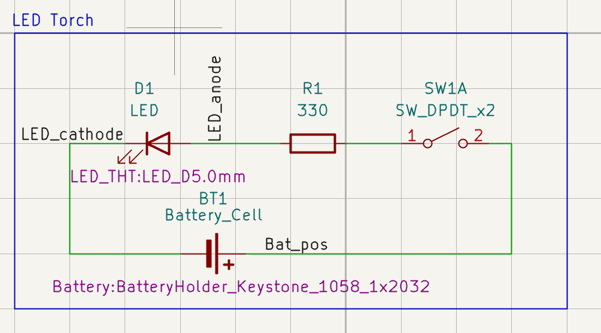
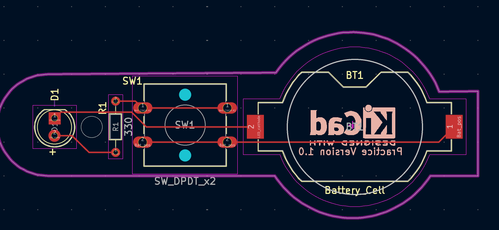

# LED Torch

My first KiCad practice project completed while learning PCB design.

## Project Overview

This is a simple battery-powered LED torch circuit created as a KiCad learning exercise.

The project includes:
- CR2032 battery
- LED
- 330 Ω current-limiting resistor
- DPDT switch

## Schematic

## PCB Layout

## What I Practiced

- Schematic capture
- Footprint assignment
- PCB component placement
- Routing
- Board outline design
- Basic ERC/DRC workflow

## Project Files

- `LED_Torch.kicad_pro`
- `LED_Torch.kicad_sch`
- `LED_Torch.kicad_pcb`

## Status

Learning project completed as part of an online KiCad course.  
This design has not been fabricated or independently validated.
