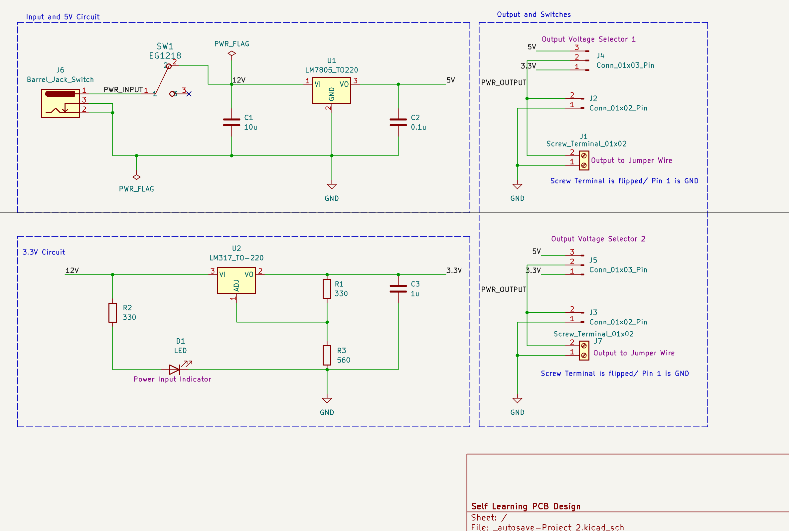
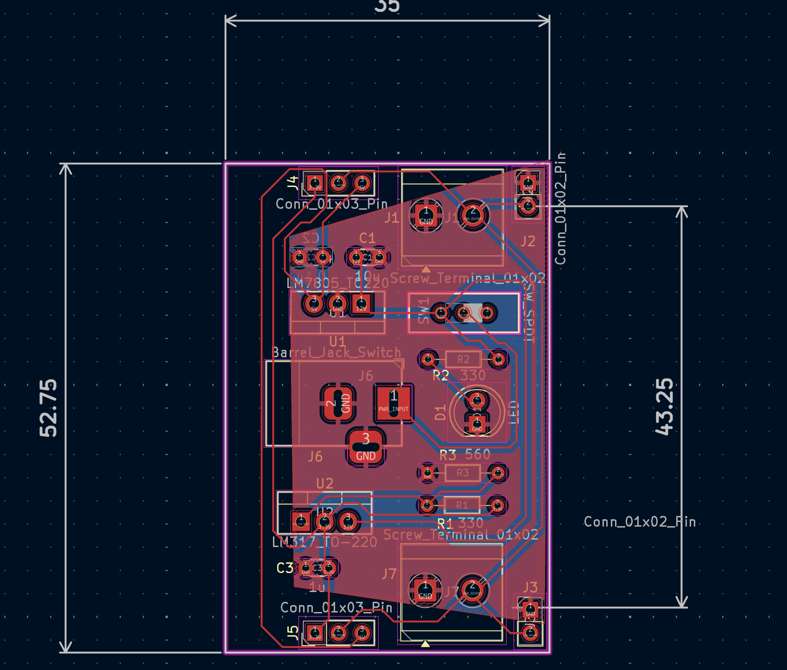

# Breadboard Power Supply

A self-learning PCB design project created in KiCad.

This project converts a 12 V DC input into regulated 5 V and 3.3 V outputs for breadboard prototyping.

## Features

- 12 V DC barrel jack input
- Power switch
- 5 V output using LM7805 linear regulator
- 3.3 V output using LM317 adjustable regulator
- Power indicator LED
- Selectable 5 V / 3.3 V outputs
- Screw terminal and pin-header outputs
- Ground plane on PCB
- ERC/DRC checked in KiCad

## Schematic

## PCB Layout

## What I Practiced

- Reading regulator datasheets
- Designing regulated power rails
- Schematic capture
- Footprint selection
- PCB component placement
- Power routing
- Ground plane design
- Thermal relief connections
- ERC and DRC checking
- Debugging PCB layout issues

## Design Notes

The board uses a 12 V DC input and provides regulated 5 V and 3.3 V outputs.

The LM7805 provides the fixed 5 V rail, while the LM317 uses a resistor network to set the 3.3 V output.

This project was created as part of my self-learning process in PCB design and power supply fundamentals.

## Status

PCB design completed and DRC passed.

This project has not yet been fabricated or hardware-tested.
